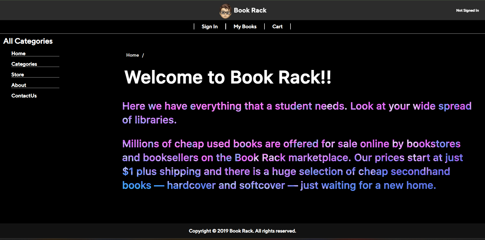
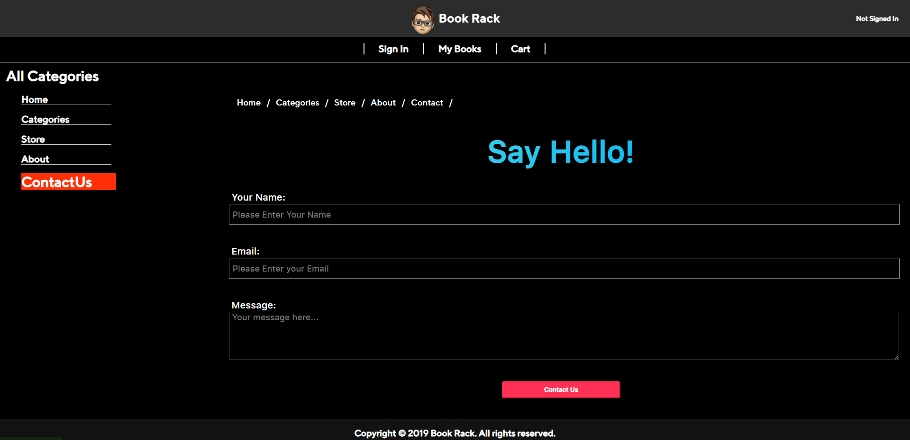

# Online Book Rack Trading & Bug Reporting Web Portal

## Project Overview
This web portal enables users to trade books online and report bugs efficiently. Built using **Node.js, HTML5, CSS3, and MongoDB**, the platform offers a seamless user experience for book trading and bug tracking.

## Features
✅ **Book Trading System** – Users can list books for trade and request books from others.  
✅ **Bug Reporting Module** – Users can report bugs with descriptions and track their status.  
✅ **User Authentication** – Secure login and signup with hashed passwords.  
✅ **Responsive UI** – Designed with modern CSS for an optimal viewing experience.

---

## Tech Stack

- **Frontend:** HTML5, CSS3, JavaScript
- **Backend:** Node.js, Express.js
- **Database:** MongoDB
- **Authentication:** JWT (JSON Web Tokens)
- **Styling:** Bootstrap/Tailwind CSS

---

## Installation Guide

1. **Clone the Repository**
   ```bash
   git clone https://github.com/tan-nandam/Book-Rack.git
   cd Book-Rack
   ```

2. **Install Dependencies**
   ```bash
   npm install
   ```

3. **Set Up Environment Variables**
   Create a `.env` file in the root directory and add the following:
   ```env
   MONGO_URI=your_mongodb_connection_string
   JWT_SECRET=your_secret_key
   PORT=5000
   ```

4. **Run the Application**
   ```bash
   node app.js
   ```
   The server will start at **http://localhost:8080**

---

## Screenshots

### Homepage


### Book Trading Page


### Book Rack About


### Book Rack Contact



## Contributing
Feel free to fork this repo and submit pull requests with improvements.
